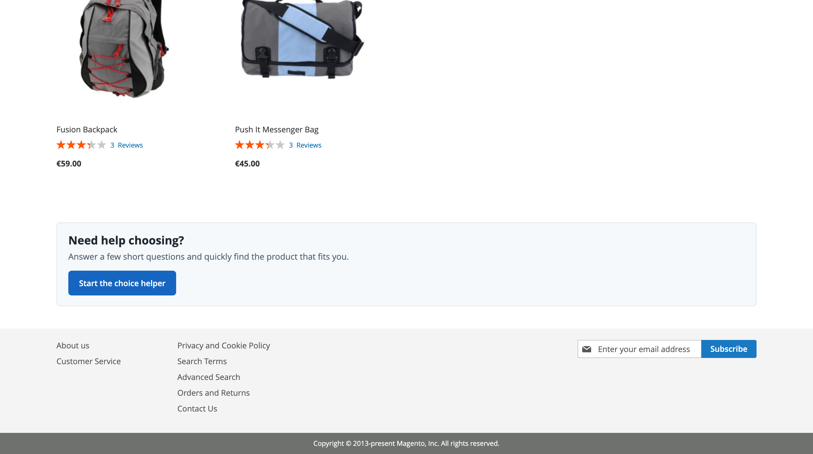
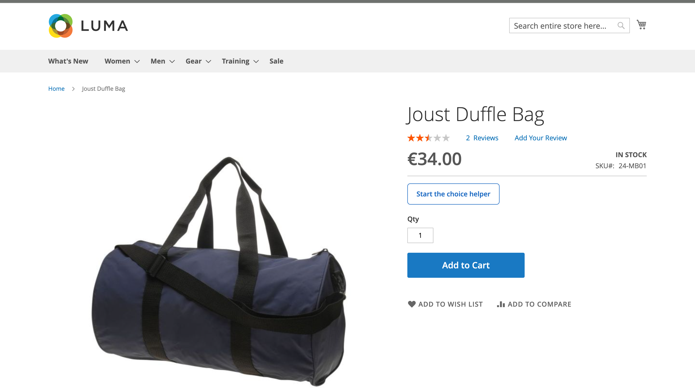

# BerryPath Flow for Magento 2

Magento 2 module for the [BerryPath](https://www.berrypath.eu) Flow widget.

BerryPath helps ecommerce teams add guided selling, product finder flows and guided product advice to their webshop. In Magento 2, this module makes those Flow widgets available on category pages, product detail pages and CMS/widget placements.

The category banner title and description are rendered as regular Magento HTML, so merchants can add relevant, indexable context around product advice flows.

## Installation

```bash
composer require berrypath/magento2-berrypath-flow
bin/magento module:enable BerryPath_Flow
bin/magento setup:upgrade
bin/magento cache:flush
```

For local `app/code` development, place it at:

```text
app/code/BerryPath/Flow
```

## Configuration

Global settings are in:

```text
Stores > Configuration > BerryPath > Flow
```

Use this for global enable/disable, locale code, market code, product ID source, product feed and the success pixel.

The locale code is passed to the BerryPath embed as `data-berrypath-locale`. Leave it empty to derive the primary language from the Magento store locale, for example `de_DE` becomes `de` and `fr_FR` becomes `fr`.

Enable the widget per page by entering a Flow UUID:

- Category: `Catalog > Categories > BerryPath Flow`
- Product: `Catalog > Products > BerryPath Flow`
- CMS/widget usage: Magento widget `BerryPath Flow`

If no Flow UUID is set on the category, product or widget, nothing is rendered.

The success pixel is enabled by default. On the Magento checkout success page it loads the main `berrypath.js` file and passes the order total plus product identifiers through `window.BerryPath.conversion(...)` for assisted conversion tracking.

## Product Feed

The module can generate an XML product feed per Magento store view:

```text
Stores > Configuration > BerryPath > Flow > Product feed
```

The admin configuration shows a preview URL and XML feed URL for every store view.

Feed endpoint:

```text
/berrypath/feed/id/{store_id}
```

Optional parameters:

- `pid`: fetch one product by the configured Product ID source.

The feed uses the Magento store context, so store-scoped product values, product URLs, image URLs, currency, locale, market code and review summary data are generated per store view.

## Hyva

For Hyva storefronts, install the separate compatibility module:

- Package: [`berrypath/magento2-berrypath-flow-hyva-compat`](https://github.com/BerryPath/magento2-berrypath-flow-hyva-compat)

The Hyva module replaces the frontend templates through `hyva-themes/magento2-compat-module-fallback`.

## Screenshots





